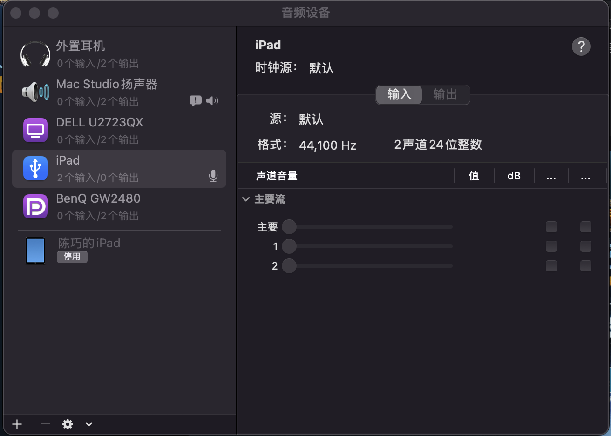

#### 一. 引用参考

```
    https://github.com/kioltk/wow-fishipy
    https://github.com/codingories/mywowfishing
    git@github.com:emil2099/Microphone_Recorder.git
```

# 使用说明

1. Mac安装[homebrew](https://brew.sh)
2. 安装portautio
3. 安装opencv
4. 安装conda
5. 安装python环境
6. 安装python依赖
7. 调整自己的钓鱼姿态，像 一样，如果是正常钓鱼方式，需要自己改下屏幕截图位置
8. 根据自己电脑配置修改mic.py里的CHANNELS,RATE,Threshold,前两个通过可以查询
9. 运行

 ``` shell
    /bin/bash -c "$(curl -fsSL https://raw.githubusercontent.com/Homebrew/install/HEAD/install.sh)"
    brew install portaudio -- HEAD
    brew install opencv
    brew install miniconda
    conda create -n py38 python=3.8
    conda activate py38
    pip install -r requirements.txt
 ```
